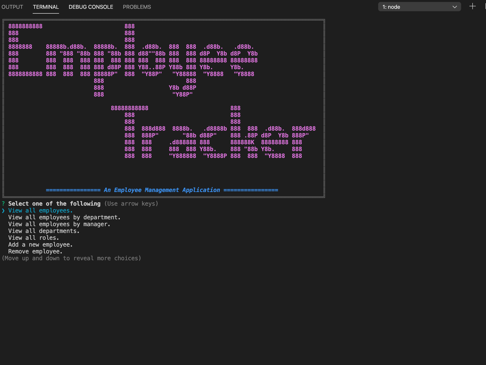
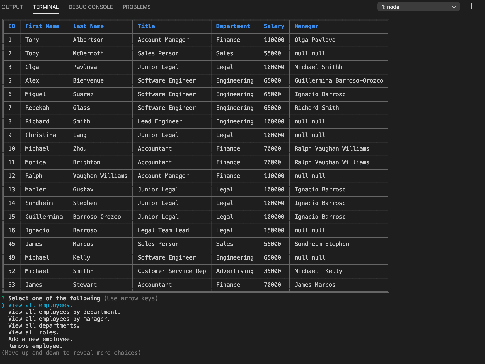

# Employee-Tracker README

# Table of contents
1. [Project Description](#descriptionLink)
2. [Usage](#usageLink)
3. [UI](#uiLink)
4. [Version](#versionLink)
5. [Dependencies](#dependenciesLink)
6. [References](#referencesLink)
7. [Contact](#contactLink)


----

## Project Descripton <a name="descriptionLink"></a>
This CLI app is a Content Management System for organizing employee, manager, department, role, and salary data.

## Usage <a name="usageLink"></a>
In the terminal, run ```npm start```

## UI <a name="uiLink"></a>



## Version <a name="versionLink"></a>


## Dependencies <a name="dependenciesLink"></a>
-[Joi](https://www.npmjs.com/package/@hapi/joi) - For data validation

-[cli-table](https://www.npmjs.com/package/cli-table) - Table rendering

-[chalk](https://www.npmjs.com/package/chalk) - Colorizing Text

-[Figlet](https://www.npmjs.com/package/figlet) - Rendering graphics

-[Shields.io](https://shields.io/) - Badges for readme

## References <a name="referencesLink"></a>
-[Build a JavaScript Command Line Interface (CLI) with Node.js](https://www.sitepoint.com/javascript-command-line-interface-cli-node-js/) - By Lukas White and [jameshibbard](https://github.com/jameshibbard)

-[Asking questions away with Inquirer!](https://github.com/sameeri/Code-Inquirer/wiki/Asking-questions-away-with-Inquirer!) - By [Sammeeri](https://github.com/sameeri)


## Contact <a name="contactLink"></a>


 
#### Github Username: [@reyesdmusic](https://www.github.com/reyesdmusic)
#### Email: vdannyreyes@gmail.com